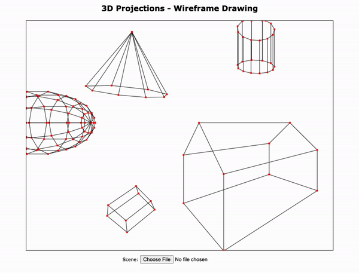

# 3D Projections for Wireframe Rendering
Ben Frey, Emma Torres, and Terence Lewis

## Project Overview 
Project Assignment Outline PDF: project_assignment.pdf

This project relates to my CISC 480: Senior Capstone course because it required significant labor division and intra-team coordination to complete all project components on time. While my partners and I were successfully able to complete all project components, ensuring that each component of the project met proper functionality specifications required multiple visits with Dr. Marrinan.

NOTE: All code in this repository has been cleaned up since the completion of this course to be featured in my senior portfolio. Additional documentation has been provided under "/docs" for future usage.

## Project Description
For this project, we had to implement 3D line drawing by projecting models onto the view-plane. We used HTML's Canvas 2D API for drawing 3D lines to the browser window. Implementation of this assignment required a thorough understanding of the computer graphics pipeline, including how the view, model, and projections matrices work with eachoter to produce animated models in the proper 3D space.
 
Project outline below:

## Executing the Project
For a quick start, check out the deployed version of this project at [benfrey.github.io/cg-3dprojections](https://benfrey.github.io/cg-3dprojections). Otherwise, simply follow the steps below: 
1. $git clone https://github.com/benfrey/cg-3dprojections
2. $cd cg-3dprojections
3. $code .
4. Install the "Live Server" extension in Visual Studio Code.
5. Click "Go Live" and navigate to project URL in a browser.
 
Note: Running "$code ." will open the project folder in Visual Studio Code.

## Running Example
An example of the project running in a browser can be seen here:

